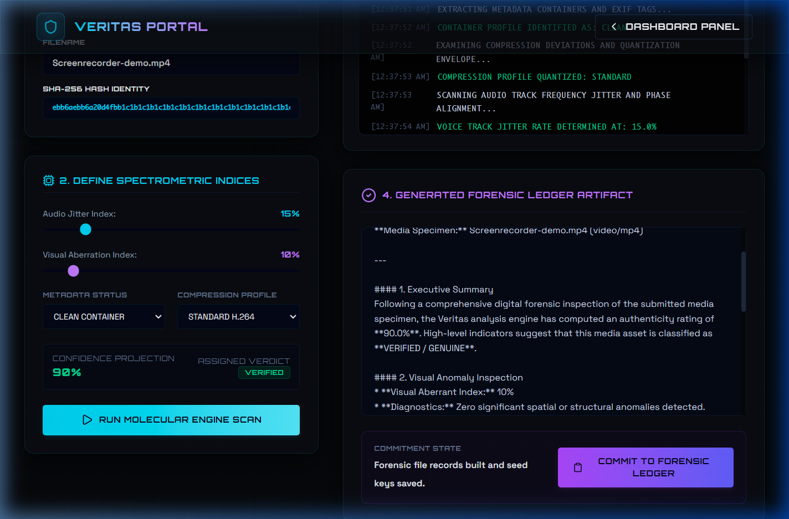
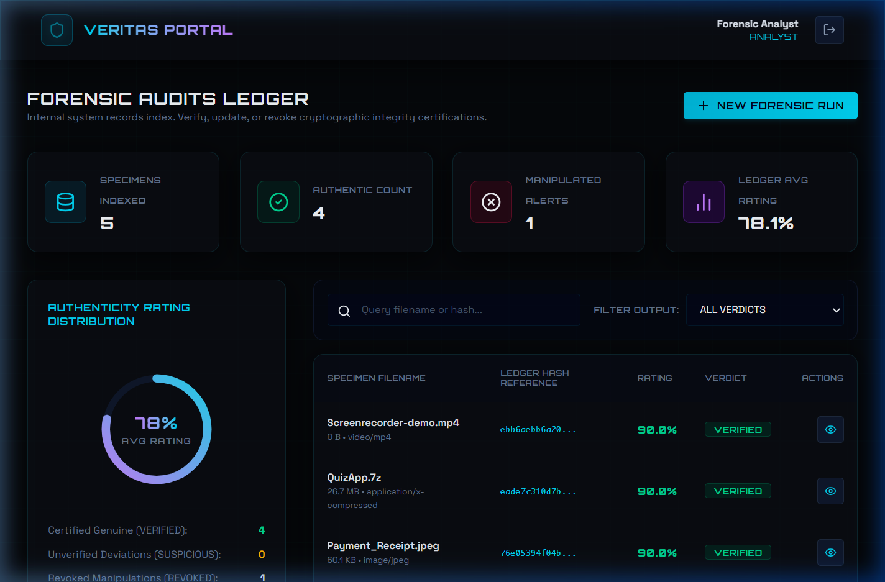
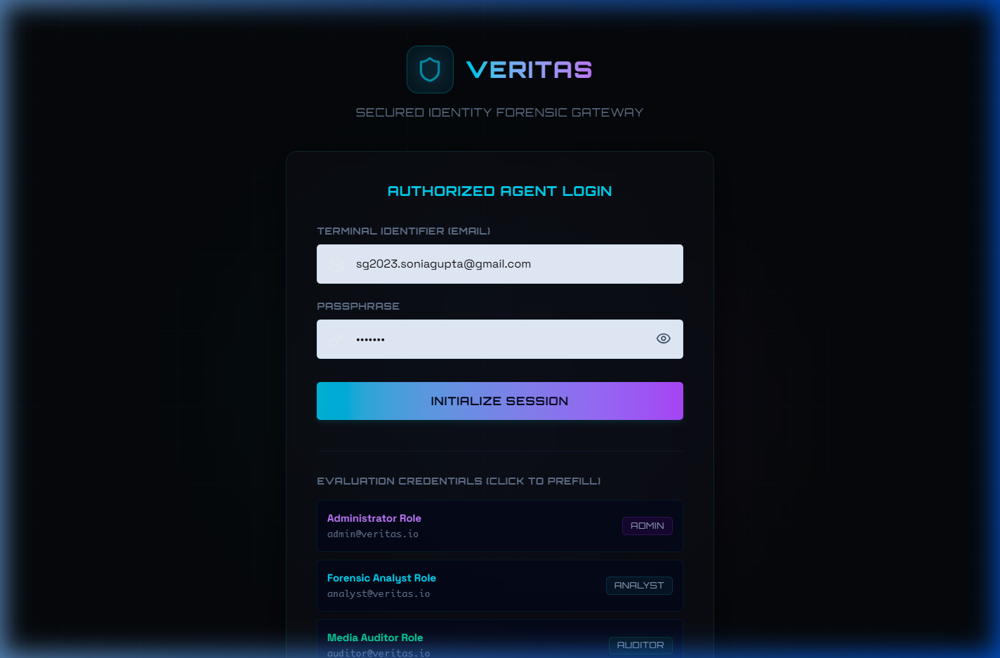

# Veritas: AI-Powered Media Forensic Authentication Platform

<p align="center">
  
</p>

**Veritas** is a state-of-the-art secure media forensic ledger designed to detect and log digital media manipulations, deep-fakes, and coordinate audits. Built using Next.js 16, React 19, Tailwind CSS 4, and Prisma, Veritas delivers a premium cyberpunk-themed aesthetic integrated with rich AI-powered analyses.

Developed by **Sonia Gupta** as a full-stack technical assessment.

---

## 📸 Interface Previews

### 1. Cyberpunk Forensic Submission Console
An analytical screen providing real-time local file hash computation, sliders to represent spectrum anomalies, and triggers for AI verification.


### 2. Forensic Authentication Ledger
A cryptographically verifiable record indexing verified and revoked items.


### 3. Portal Gateway (Login)
Role-based administrative entry node with pre-filled test keys.


---

## 🌟 Core Features

- **Cyberpunk UI/UX**: A dark-mode dashboard styled with CSS custom gradients, glassmorphism, glowing micro-animations, and responsive layouts.
- **Forensic Pipeline Analysis**: Evaluates media assets based on audio jitter coefficients, visual abnormalities, metadata profiles, and compression integrity.
- **AI Media Audit Synthesis**: Leverages Google's **Gemini API** (`@google/genai`) to generate full forensic audits, security digests, and authentication reports.
- **Role-Based Authentication**: Supports 3 permission levels (Admin, Analyst, Auditor) using JWT session tokens stored in secure, HTTP-only cookies.
- **Real-Time Forensic Ledger**: Secure page representing registered report metadata where auditors and analysts search, filter, and audit media file hashes (SHA-256).
- **Interactive Security Audits**: Logs all actions (`REPORT_CREATE`, `USER_LOGIN`, etc.) in an admin audit trail.
- **Zero-Config Serverless Deployment**: Includes a custom database helper that dynamically copies SQLite to `/tmp` on serverless execution contexts to enable full read-write actions on ephemeral hosts (Vercel and Netlify).

---

## 🛠️ Architecture & Tech Stack

- **Framework**: Next.js 16.2 (App Router)
- **UI Engine**: React 19, Lucide Icons
- **Styles**: Tailwind CSS v4.0
- **Database ORM**: Prisma v5.22
- **Database Engine**: Serverless SQLite
- **Security**: JWT (`jose`), Password hashing (`bcryptjs`)
- **Forensic AI**: Google Gemini AI Studio SDK (`@google/genai`)

---

## 🔑 Pre-Seeded Accounts

The database comes pre-seeded with three testing accounts representing different role levels:

| User Role | Email | Password | Scope & Permissions |
| :--- | :--- | :--- | :--- |
| **Admin** | `admin@veritas.io` | `VeritasAdmin123!` | Read ledger, submit new reports, access Admin Audit log portal |
| **Analyst** | `analyst@veritas.io` | `VeritasAnalyst123!` | Read ledger, submit new reports for analysis |
| **Auditor** | `auditor@veritas.io` | `VeritasAuditor123!` | Read-only ledger audit access |

---

## 🏗️ Design Decisions & Innovations

### 1. Serverless SQLite Adapter (Zero-Config Deployment)
Serverless servers like Vercel and Netlify use read-only filesystems which normally block SQLite db writes. To resolve this:
- On project initialization inside [src/lib/db.ts](src/lib/db.ts), the application detects serverless execution environments and copies the preloaded database file (`prisma/dev.db`) into the writable `/tmp` directory.
- This allows full database interaction (registrations, logs, uploads) to work instantly without requiring complex external Postgres database setups!

### 2. Forensic Analysis Pipeline
We isolate media analysis computations:
- Users register media files (with automatically calculated SHA-256 hashes).
- Media parameters (audio jitter, visual anomalies, metadata, compression profile) are analysed.
- The details are then sent securely to Gemini to synthesize an AI forensic report containing audit sections, anomalies highlights, and security verdicts.

---

## 🚀 Getting Started

### 1. Install Dependencies
```bash
npm install
```

### 2. Configure Environment Variables
Create a `.env` file in the root directory:
```env
DATABASE_URL="file:./dev.db"
JWT_SECRET="veritas-super-secret-jwt-token-key-2026-secure-hash-security"
GEMINI_API_KEY="YOUR_GEMINI_API_KEY" # Optional: Enables live Gemini analysis
```

### 3. Initialize the Database
```bash
npm run seed     # Triggers scripts/db-setup.js to load schema and seed accounts
```

### 4. Run the Development Server
```bash
npm run dev
```
Open **[http://localhost:3000](http://localhost:3000)** to view the application.

---

## 📦 Deployment

### Deploying to Vercel/Netlify (Zero-Config)
1. Push this repository to **GitHub**.
2. Go to **Vercel** or **Netlify** and import the repository.
3. Add your environment variables:
   - `JWT_SECRET`
   - `GEMINI_API_KEY` (from Google AI Studio)
4. Click **Deploy**. (The repository's build scripts automatically generate the Prisma schema client).
